# 18.2移动办公系统

---

**客户端**

* 本案例客户端为安卓端，客户端运行的第一个界面，用户需要输入正确的手机号码和密码才可以登录到主界面，在本案例中方便起见，默认手机号码为13666666666，密码为000000.由于界面文件较为简单，不再赘述。最终显示的界面为：

<div align=center>

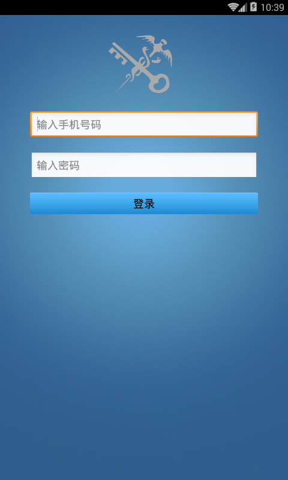

</div>

* 在LoginActivity中对文本框中手机号码和密码进行匹配，若成功则进入欢迎界面

```java
if(phoneuunstring•equals("")||phonePassword.equals(""))
	Toast.makeText(LoginActivity.this,"请输入完整的用户名和密码",Toast.LENGTH_SHORT).show();
else if(phoneNunString.equals("13555666666")&&phonePassword.equa1s("000000")){ 
	Intent =new Intent(LoginActivity.this,Welcome.class);
	startActivity(intent); 
}else { 
	Toast.makeText(LoginActivity.this,"请输入正确的用户名和密码",Toast.LENGTH_SHORT).show();
}
```


* 在Welcome.java中加载欢迎界面，在欢迎界面展示的同时将从数据库加载到mList的数据赋给全局变量userList：

```java
if (Fileservice.fiLeIsEXists()) { 
	Loadingcontacts loadingcontacts = new Loadingcontacts(welcome.this); 
	loadingContacts.setOnLoadingFinishListener((mList){ 
			sysApp. setUserList(mList); 
			Intent intent = new Intent(welcome.this, SlidingActivity.class); 
			startActivity(intent); 
			welcome.this.finish(); 
    });
	loadingContacts.execute(); 
}else{
	Intent intent new Intent(klcome.this, SlidingActivity.class); 
	startActivity(intent); 
     Welcome.this.finish(); 
}
```

* 随后进入案例的主界面SlidingActivity，如果是第一次登录客户端，将会提示通讯录为空，是否需要现在导入数据的对话框：

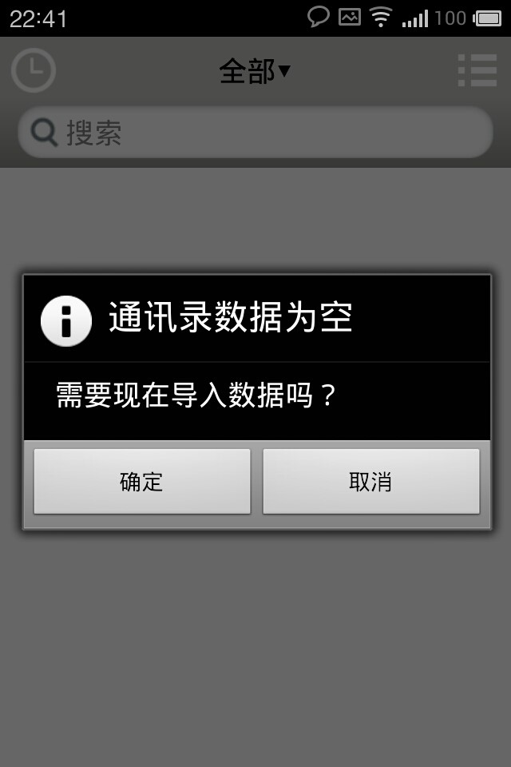

* 导入成功后显示所有的联系人的信息

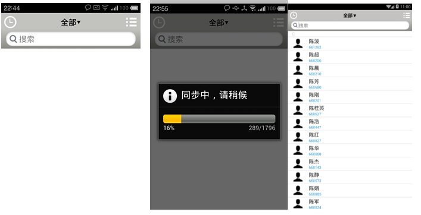

* 在SlidingActivity界面中我们将它分成3个Fragment进行管理，分别是leftFragment,rightFragment和centerFragment。其中最重要的是centerFragment，在SlidingActivity界面中可以通过左右滑动进入leftFragment和rightFragment中，在centerFragment界面最上方有个应用PopupWindow的下拉框，实现代码如下：

```java
public void SelectDepartClick()
	{
		int screenWidth = getActivity().getWindow().getWindowManager()
				.getDefaultDisplay().getWidth();
		int screenHeight = getActivity().getWindow().getWindowManager()
				.getDefaultDisplay().getHeight();
		if (popup == null)
		{
			// View root = getActivity().getLayoutInflater().inflate(
			// R.layout.popup_select_depart, null);
			popup = new PopupWindow(root, screenWidth * 2 / 3,
					(int) (screenHeight * 0.75));
			popup.setBackgroundDrawable(new BitmapDrawable());
			popup.setOutsideTouchable(true);// 让PopupWindow其之外点击 消失
			popup.showAsDropDown(layoutHeader, screenWidth / 6, 0); // 居中
			// popup.showAsDropDown(layoutHeader);
			btnSelectDepart.setText(btnSelectDepart.getText().toString()
					.replaceFirst("▼", "▲"));
			popup.setOnDismissListener(new OnDismissListener()
			{
				@Override
				public void onDismiss()
				{
					btnSelectDepart.setText(btnSelectDepart.getText()
							.toString().replaceFirst("▲", "▼"));
				}
			});
			DepartmentDao departmentDao = (DepartmentDao) DaoFactory.getDao(
					getActivity(), "DepartmentDao");
			departments = departmentDao.findByLevel(-2);
			departmentDao.close();

			PopListAdapter pa = new PopListAdapter(getActivity(), departments,
					popup, group, childItim, btnSelectDepart);

			listDeparts.setAdapter(pa);
		}
		else if (popup.isShowing())
		{
			popup.dismiss();
		}
		else
		{
			popup.showAsDropDown(layoutHeader, (screenWidth - 320) / 2, 0);
			btnSelectDepart.setText(btnSelectDepart.getText().toString()
					.replaceFirst("▼", "▲"));
		}
	}

```

* 显示效果如下图所示：

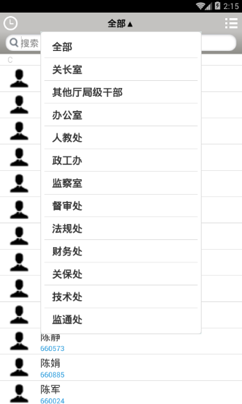

* 用户可以通过点击所在的部门进行精确查找，除了通过下拉菜单查找之外还提供精确查找，在搜索框中输入所要查找的用户的关键字就能迅速查找到，实现方法是通过监听搜索文本框的内容是否改变，代码如下所示：

```java
public void afterTextChanged(Editable s)
		{
			// TODO Auto-generated method stub
			UserDao userDao = (UserDao) DaoFactory.getDao(getActivity(),
					"UserDao");
			ArrayList<ContentValues> results = new ArrayList<ContentValues>();
			// 报错的地方，此处list可能为空
			Iterator<ContentValues> it = list.iterator();
			ContentValues cv;
			String userName, userPinyin, userNo, shortPhone, firstAlphabets = "";
			String searchKey = txtSearch.getText().toString();
			while (it.hasNext())
			{
				cv = it.next();
				userName = cv.getAsString(NAME);
				userPinyin = cv.getAsString(PINYIN);
				userNo = cv.getAsString(SERIAL_NUM);
				shortPhone = cv.getAsString(NUMBER);
				if (userName.startsWith(searchKey)
						|| userPinyin.startsWith(searchKey)
						|| userNo.startsWith(searchKey)
						|| shortPhone.startsWith(searchKey))
					results.add(cv);
			}
			userDao.close();
			// 不为空，显示搜索结果
			if (!txtSearch.getText().toString().equals(""))
			{

				setListAdapter(new ResultAdapter(getActivity(), results));

			}
			// 为空，显示全部
			else
			{

				if (list.size() > 0)
					setAdapter(list);

			}

		}

```

* 实现效果如下图：

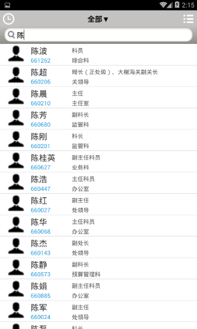

* 点击用户的头像可以直接拨打该联系人的电话，点击除用户头像之外的地方就会跳转到用户的详细信息界面。用户详细信息界面显示的内容包括：用户姓名，性别，所属部门，所属科室，担任职位，出生年月，办公电话1，办公专网，单位地址和家庭地址，最后显示的效果如下图所示：

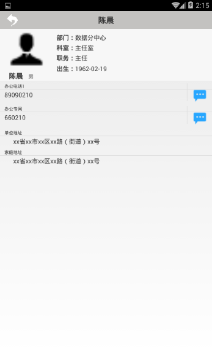

* 界面显示的部分比较简单，关键在于从数据库获取Dao类，获取每个用户的所有信息，也可以点击最右侧的短信按钮直接发送短信，实现代码如下：

```java
if(i == 0){
	title.setText("办公专网"); 
	final String phoneNum = user.getShortPhone1(); 
	Log.d(TAG,phoneNum); 
	if(phoneNum. equals("") continue; 
	number.setText(phoneNum); 
	//Button call = (Button)phoneView[i].findViewById(R.id.call);
	number.setOnClickListener(new OnClickListener(){ 
     	@Override 
		public void OnClick(view arg0) { 
			PhoneService.phoneCaLL(UserInfo.this,phoneNum);
    	}
    });
	Button sms = (Button) phoneView[i].findViewById(R.id.sms);  
	sms.setOnClickListener(new OnClickListener() {
      	@Override
      	public void onClick(View arg0) { 
			PhoneService.smsTo(UserInfo.this, phoneNum);
        }
    });
}
```

* 点击主界面右上方按钮或从右向左滑动将查看软件设置等信息

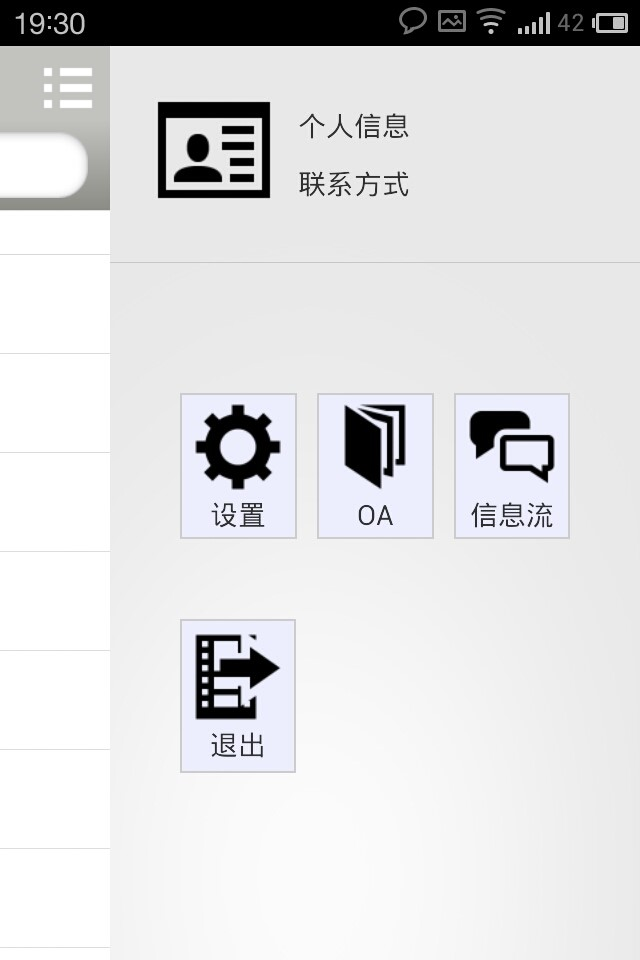

* 设置，OA，信息流，退出这几个是指定的按钮，每个按钮都是一个LinearLayout，在每个LinearLayout中分成上下两个部分，上方的图标的部分才是真正的Button组件，同个setbackground可以自定义Button的图标，而下方就是一个TextView，关键代码如下所示：

```java
<LinearLayout 
	android:layout_width="match_parent" 
	android:layout_height= wrap_content" 
	androidlayout_margin="5dip" 
	android:layout_weight= "1"
	android:background="@drawable/more_button_bg" 
	android:gravity:"center horizontal" 
	android:orientation="vertical" 
	android:padding="3dip"> 
	<Button 
		android:id="@•id/settingButton" 
		android:layout_width="wrap_content" 
		android:layout_height="wrap_content 
		android:background="@drawable/setting" 
	<TextView 
		android:layout_width="48dip" 
		android:layout_height="wrap content" 
		android:gravity="center horizontal" 
		android:text="设置"/> 
</LinearLayout> 
```

* 点击设置进入软件设置界面

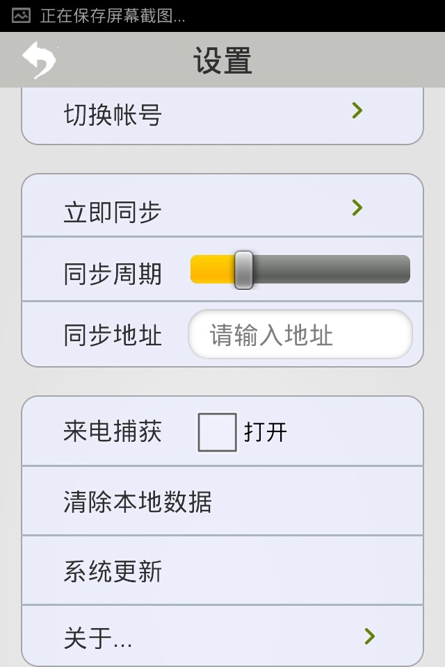

* 软件设置界面包括：个人信息，切换账号，立即同步，设置同步周期，设置同步地址，来电捕获，清除本地数据，系统更新，关于。若服务器地址迁移，可在同步地址中进行配置

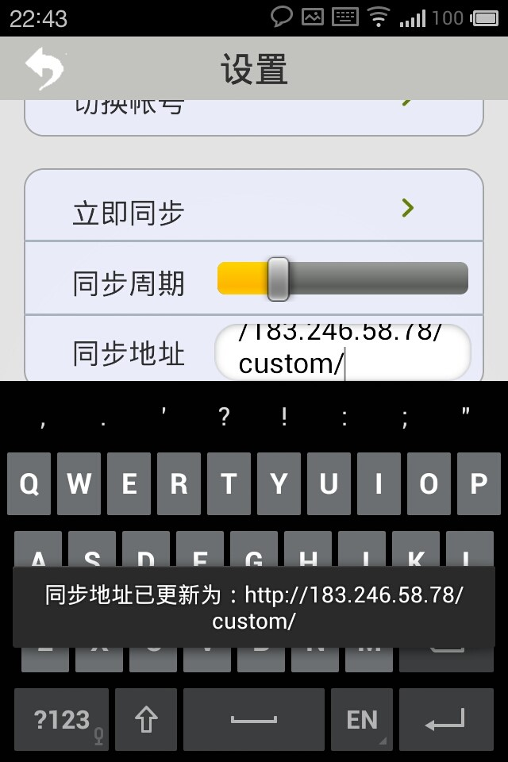

* 核心代码如下：

```java
public void afterTextChanged(Editable s)
{
  	//TODO Auto-generated method Stub 
	if(txtUrl.getText().toString() == null || txtUrl.getText().tostring().equals("")|| txtUrl.getText().toString() == null)
      {
        	//Toast.makeText(Settings.this,"同步地址未更新",Toast.LENGTH_LONG).show();
      		//return;
      }
  	else
      {
         ServerConst.ROOT_URI = txtUrl.getrext().toString(); 
		System.out.println("ServerConst.ROOT_URI_URI"+ServerConst.Root_URI); 
		Toast.makeText(Settings.this,"同步址己史新为: "+ServerConst.ROOT_URI,1).show();
    }
}
```

* 用户也可以清空所有的数据

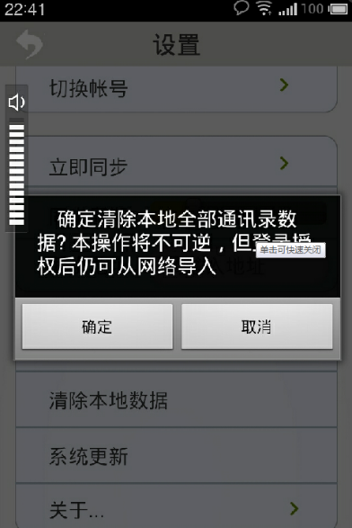

* 核心代码如下：

```java
public void clearData_Click(View view) {
        final Builder builder = new Builder(this);
        builder.setIcon(android.R.drawable.ic_dialog_info);
        builder.setMessage("    确定清除本地全部通讯录数据? 本操作将不可逆，但登录授权后仍可从网络导入");
        builder.setPositiveButton("确定", new DialogInterface.OnClickListener() {
            @Override
            public void onClick(DialogInterface dialog, int which) {
                if (FileService.fileIsExists()) {
                    FileService.deleteData();
                    // String spName = "SharedPreferences";

                }

                try {
                    SharedPreferences dataBase;
                    dataBase = getSharedPreferences(SysConst.PREFERENCE_NAME,
                            Context.MODE_PRIVATE);

                    dataBase.edit().clear().commit();

                    dataBase = null;
                    dataBase = getSharedPreferences("userInfo", Context.MODE_WORLD_READABLE);
                    dataBase.edit().clear().commit();

                } catch (Exception e) {

                }


                Toast.makeText(Settings.this, "删除数据成功,将退出应用", 3).show();
                System.exit(0);
            }
        });
        builder.setNeutralButton("取消", null);
        builder.create().show();
    }

```

* 信息流界面

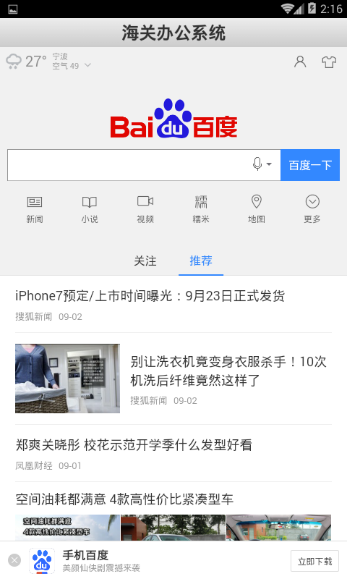

* 在软件中内置WebView实现浏览器的功能，将后退键功能自定义为内置浏览器的回退，并支持网页的JavaScript，核心代码如下所示：

```java
public class Message extends Activity {

    private WebView webView = null;
    private ProgressBar progressBar = null;
    private String urlStream = "http://baidu.com";

    @Override
    protected void onCreate(Bundle savedInstanceState) {
        super.onCreate(savedInstanceState);
        setContentView(R.layout.oa);
        progressBar = (ProgressBar) findViewById(R.id.progressBar1);
        webView = (WebView) findViewById(R.id.webView);
        webView.getSettings().setJavaScriptEnabled(true);
        int screenWidth = getWindow().getWindowManager().getDefaultDisplay().getWidth();
        //原始网页宽度为320
        webView.setInitialScale((int) (screenWidth * 100 / 320));
        //固定Url
        webView.loadUrl(urlStream);
        //网络获取Url
        webView.setWebViewClient(new WebViewClient());
        setProgressTimer();
    }

    @Override
    protected void onResume() {
        super.onResume();
        //webView.clearHistory();
        //webView.loadUrl(urlOa);
    }
    private void setProgressTimer() {
        webView.setWebChromeClient(new WebChromeClient() {
            @Override
            public void onProgressChanged(WebView view, int progress) {
                super.onProgressChanged(view, progress);
                if (progress < 100 && progressBar.getVisibility() == ProgressBar.GONE) {
                    progressBar.setVisibility(ProgressBar.VISIBLE);
                }
                progressBar.setProgress(progress);
                if (progress == 100) {
                    progressBar.setVisibility(ProgressBar.GONE);
                }
            }
        });
    }

    @Override
    public boolean onKeyDown(int keyCode, KeyEvent event) {
        if (keyCode == KeyEvent.KEYCODE_BACK && webView.canGoBack()) {
            webView.goBack();
            return true;
        }
        return super.onKeyDown(keyCode, event);
    }

    private class HelloWebViewClient extends WebViewClient {
        @Override
        public boolean shouldOverrideUrlLoading(WebView view, String url) {
            view.loadUrl(url);
            return true;
        }
    }

}
```

* 点击后退键将提醒用户是否退出提醒，再次按退出键将退出应用关于界面，软件版本、版权等信息。

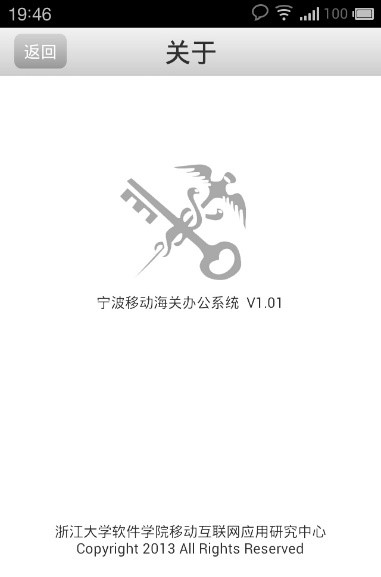


